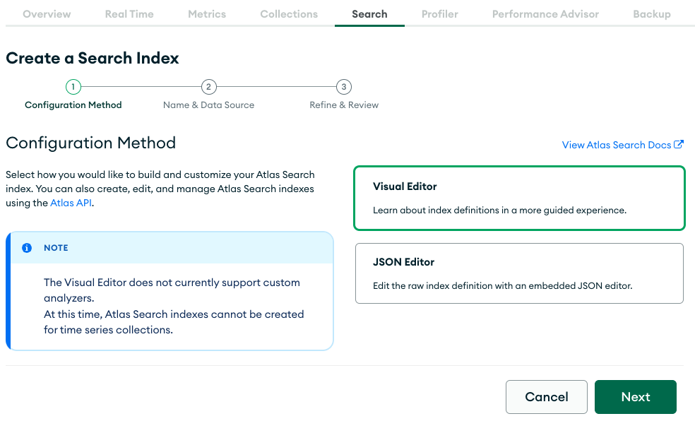
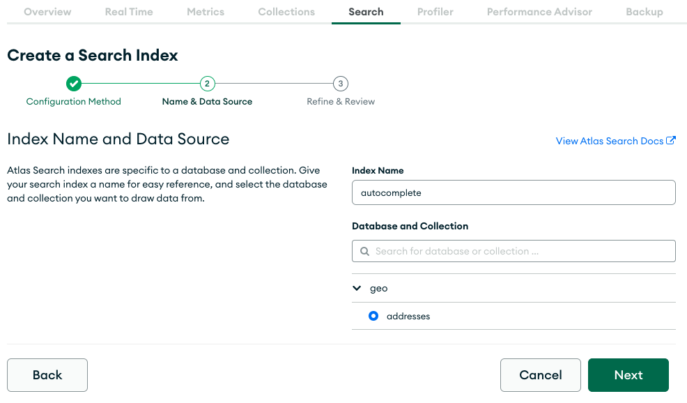
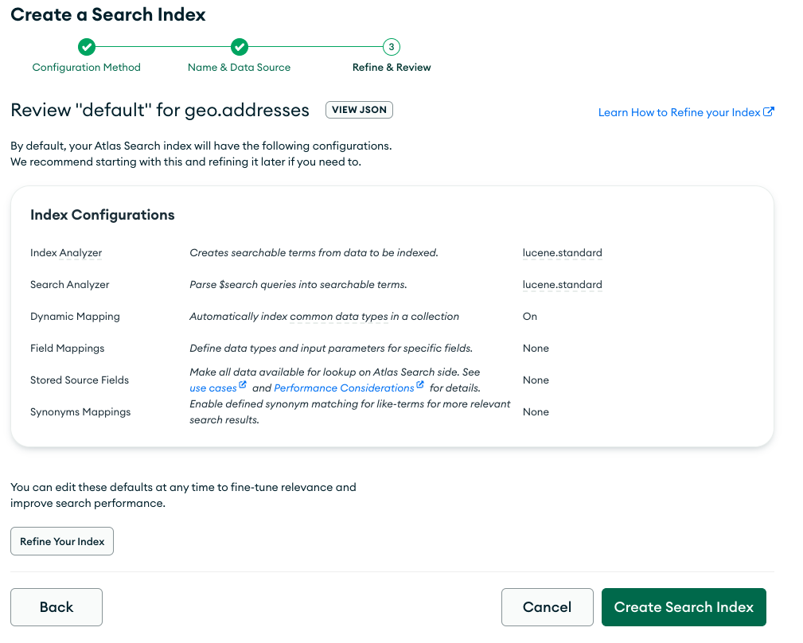
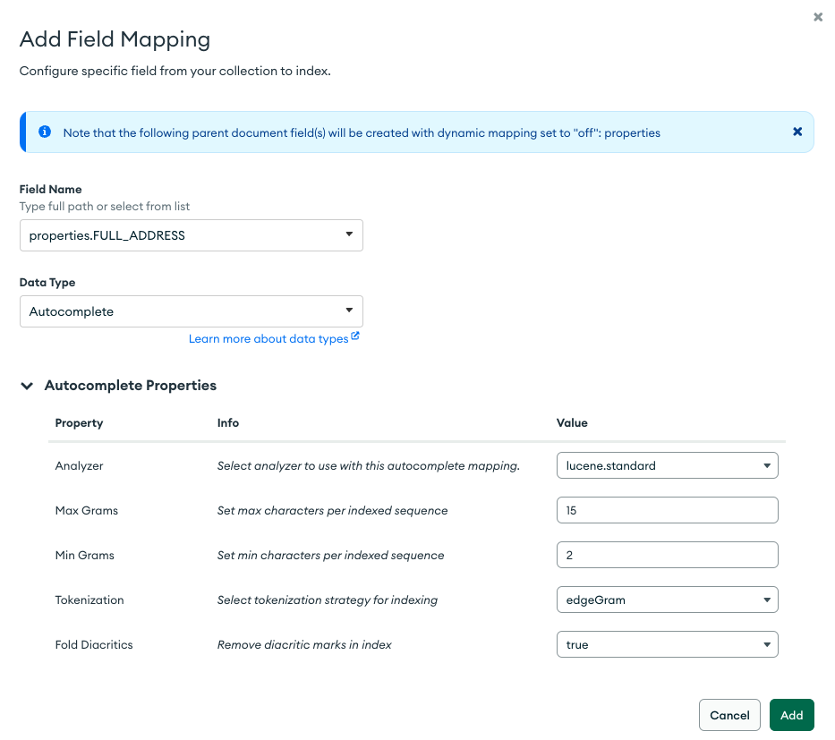
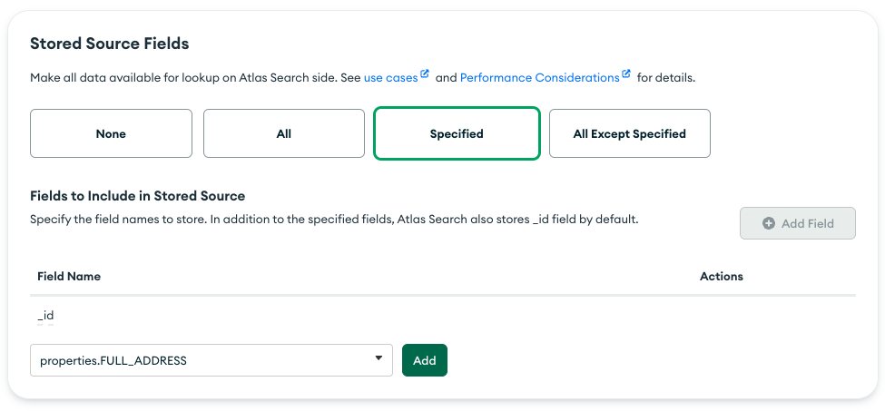
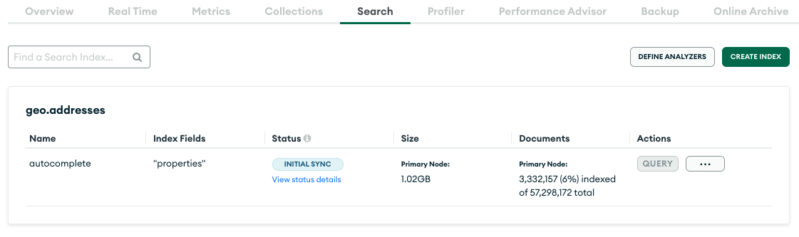
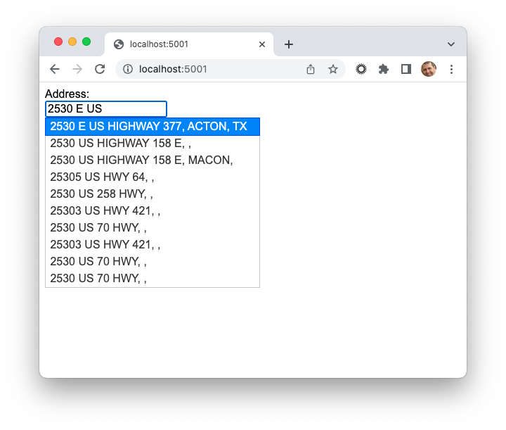
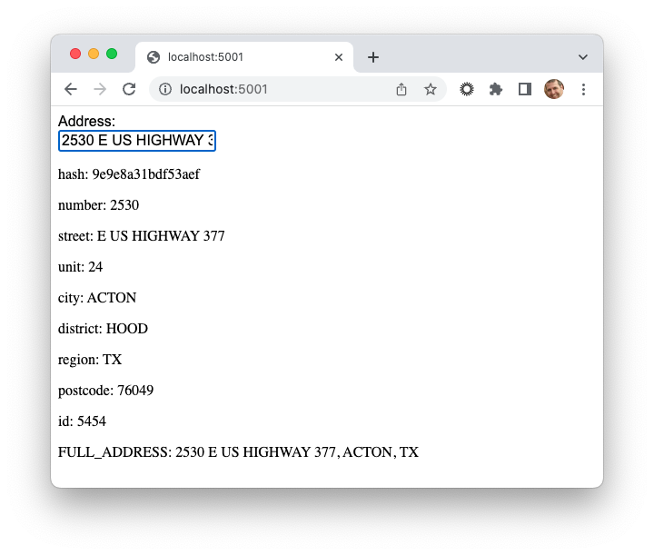
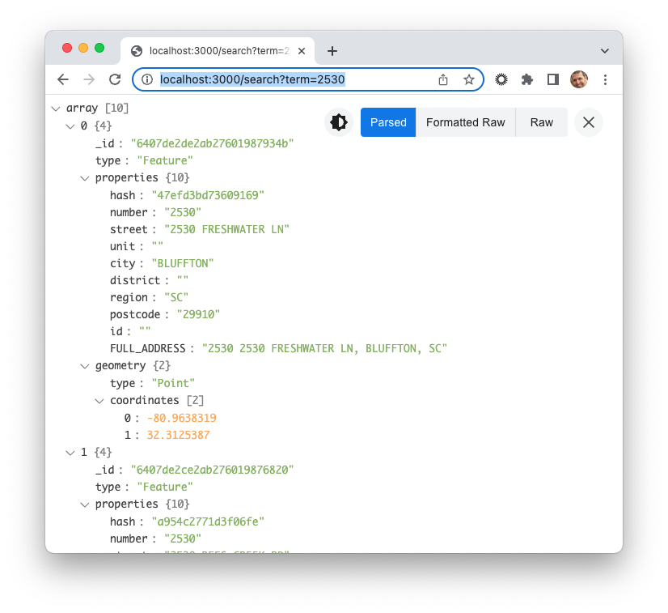

# MongoDB Atlas Search Autocomplete Example

This example uses data from the [OpenAddresses](https://openaddresses.io/) data collection to demonstrate how MongoDB Atlas Search's autocomplete feature can be used for address validation.

## Data Load

The address data from OpenAddresses is provided as a zip which extracts into several directories and files. In addition to the address information, the OpenAddresses data also includes buildings and parcels data, which I'm not interested in for this exercise. I used the following script to load the data into Atlas:

```bash
for dir in */; do
   echo "$dir"
   for file in "$dir"*addresses*.geojson; do
       mongoimport --uri <Atlas Application Connection Sting>/geo -collection addresses --file "$file"
       echo "$file"
   done
done
```
A sample document from the collection looks as follows:
```javascript
{
  _id: ObjectId("6407ef20a9c2753ef45d12b0"),
  type: 'Feature',
  properties: {
    hash: '9e9e8a31bdf53aef',
    number: '2530',
    street: 'E US HIGHWAY 377',
    unit: '24',
    city: 'ACTON',
    district: 'HOOD',
    region: 'TX',
    postcode: '76049',
    id: '5454',
  },
  geometry: {
    type: 'Point',
    coordinates: [
      -97.7424314,
      32.4490136
    ]
  }
}
````
## Data Prep

As you can see from the sample address document above, there isn't a single field to run an address search against, which we'll need for our autocomplete index, so let's create one using the [$concat](https://www.mongodb.com/docs/manual/reference/operator/aggregation/concat/) operator:

```JavaScript
db.addresses.aggregate([
  {
    $set:
      {
        "properties.FULL_ADDRESS": {
          $concat: [
            "$properties.number",
            " ",
            "$properties.street",
            ", ",
            "$properties.city",
            ", ",
            "$properties.region",
          ],
        },
      },
  },
  {
    $out:
      "addresses",
  },
])
```

This will create a new `FULL_ADDRESS` field in our documents, for example: 

```javascript
FULL_ADDRESS: '2530 E US HIGHWAY 377, ACTON, TX'
```

## Search Index
Let's next create a [autocomplete](https://www.mongodb.com/docs/atlas/atlas-search/autocomplete) index on that new searchable field. In the Atlas UI, navigate to the **Search** tab and select **Create Index**:



Select the **Visual Editor** and click **Next**.

Name the index and select the collection where you loaded the address data:



Click **Next** and select the button to **Refine Your Index**:



Disable Dynamic Mapping and click **Add Field Mapping**:



Select the path to your full address field and set the Data Type to **Autocomplete**. Feel free to adjust the Autocomplete Properties to your liking. See the [autocomplete](https://www.mongodb.com/docs/atlas/atlas-search/define-field-mappings/#autocomplete) Atlas Search Field Type for details.

For a performance boost, store the full address field in the autocomplete index. Think of this as a covered query, as it will save Atlas the trouble of returning to MongoDB for the value.



Click **Save Changes** and wait for the index generate.




## Testing
We can use the [autocomplete](https://www.mongodb.com/docs/atlas/atlas-search/autocomplete/#std-label-autocomplete-ref) operator from Compass or the Shell to test the index. For example:

```javascript
db.addresses.aggregate([
  {
    $search: {
      index: "autocomplete",
      autocomplete: {
        path: "properties.FULL_ADDRESS",
        query: "2530",
      },
    },
  }
])
{
  _id: ObjectId("6407de2de2ab27601987934b"),
  type: 'Feature',
  properties: {
    hash: '47efd3bd73609169',
    number: '2530',
    street: '2530 FRESHWATER LN',
    unit: '',
    city: 'BLUFFTON',
    district: '',
    region: 'SC',
    postcode: '29910',
    id: '',
    FULL_ADDRESS: '2530 2530 FRESHWATER LN, BLUFFTON, SC'
  },
  geometry: {
    type: 'Point',
    coordinates: [
      -80.9638319,
      32.3125387
    ]
  }
}
```

## A Simple UI
This simple UI is based on Nic Raboy's [Building an Autocomplete Form Element with Atlas Search and JavaScript](https://www.youtube.com/watch?v=3IDlOI0D8-8). In summary, Nic builds from scratch a backend REST API and a frontend HTML page that calls the API. It's excellent and worth the watch, but for this exercise we can proceed straight to Go. 

### Step 1 - Get the Code
Clone this repo. 

```bash
> git clone https://github.com/wbleonard/atlas-search-autocomplete.git
```

### Step 2 - Backend
```bash
> cd backend
> npm install
```

Set the following properties in the [.env](./backend/.env) file.

```properties
MONGODB_CONNECTION_STRING='<Your MongoDB Connection String>' 
DATABASE=geo
COLLECTION=addresses
```

The start the backend server
```bash
> node main.js
```

### Step 3 - Frontend

As Nic did, we will use [serve](https://www.npmjs.com/package/serve) to run the frontend. If you don't already have serve installed:

```bash
> npm install --global
```

Then, launch serve, setting the port to whatever you prefer: 
```
> cd frontend
> serve -l 5001
```


### Step 4 - Use
It ain't pretty, but it works. Launch the UI using [http://localhost:5001](http://localhost:5001):





## Troubleshooting
If things aren't working for you, you can test the backend API from the browser, for example [http://localhost:3000/search?term=2530](http://localhost:3000/search?term=2530):




